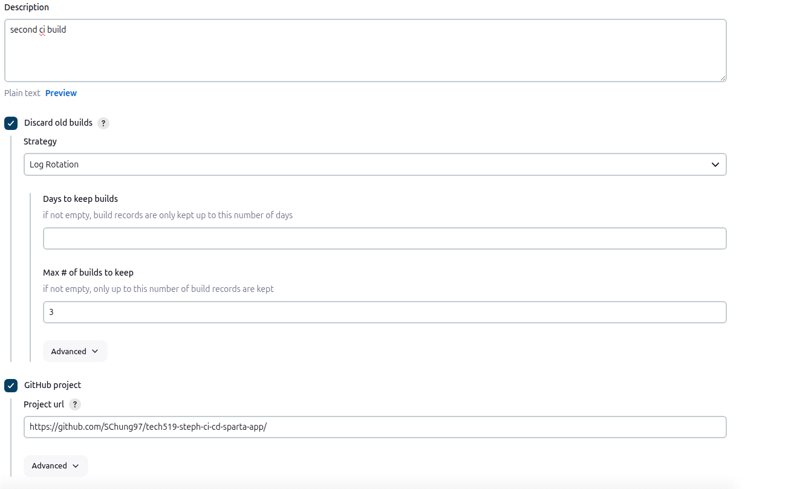
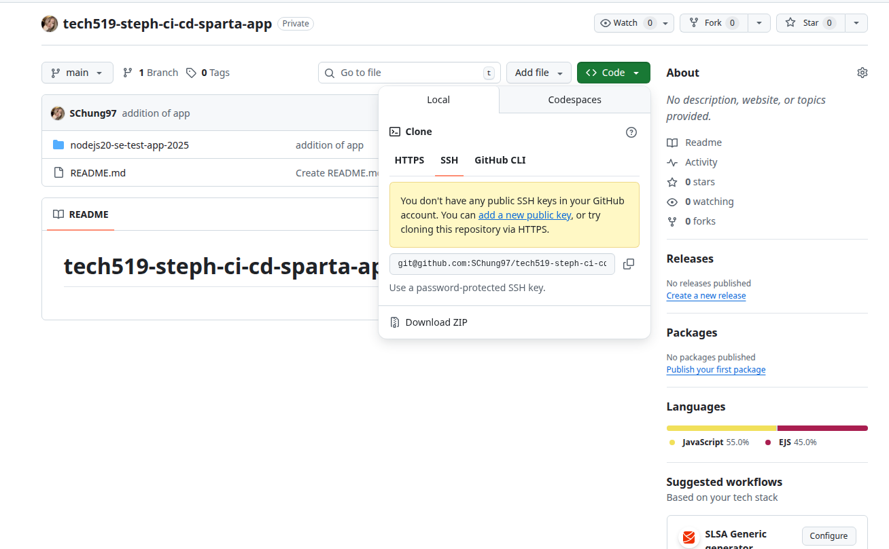
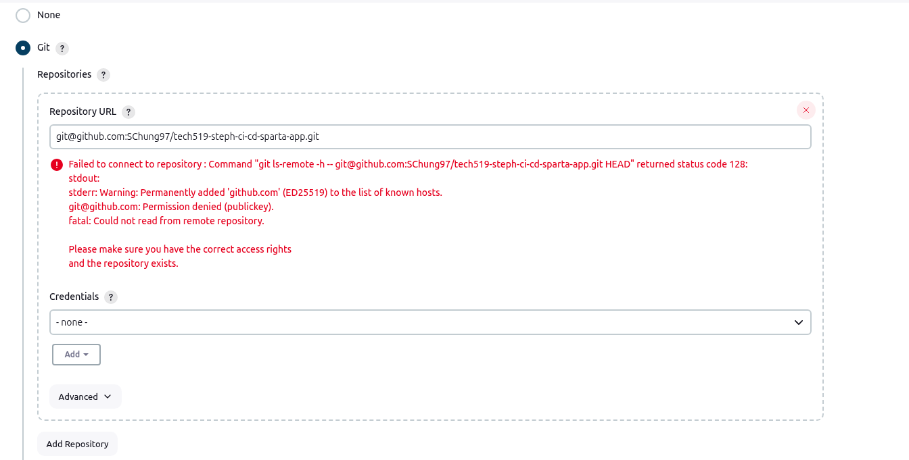
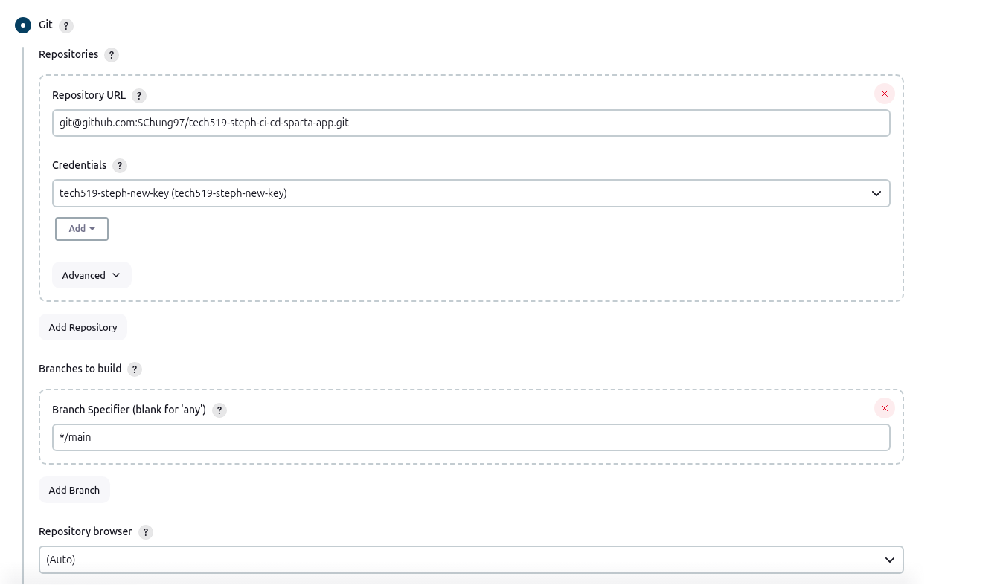
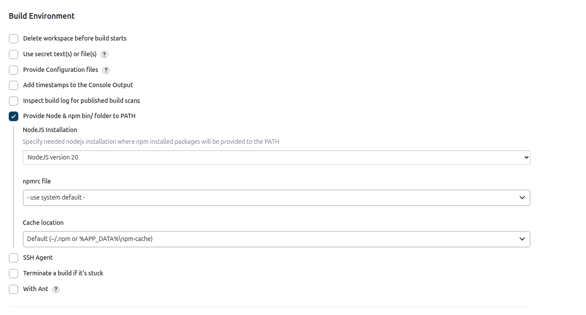
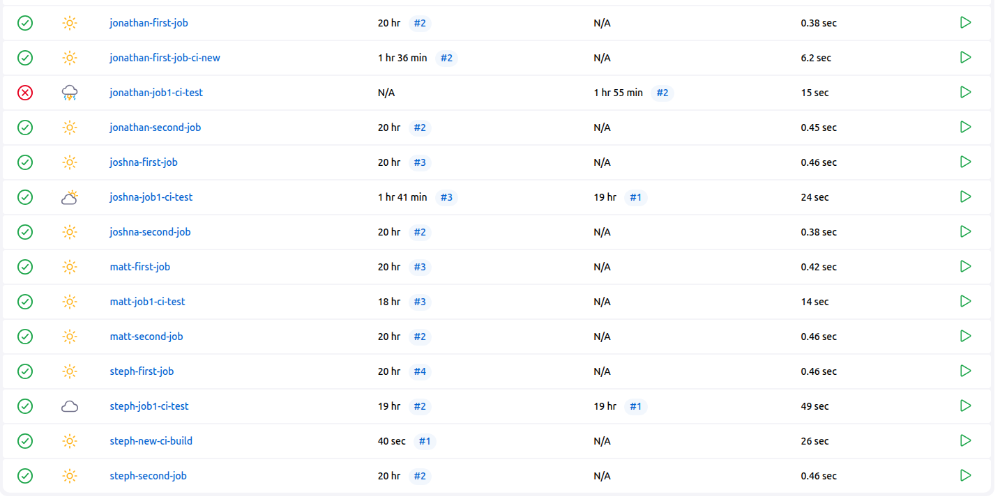
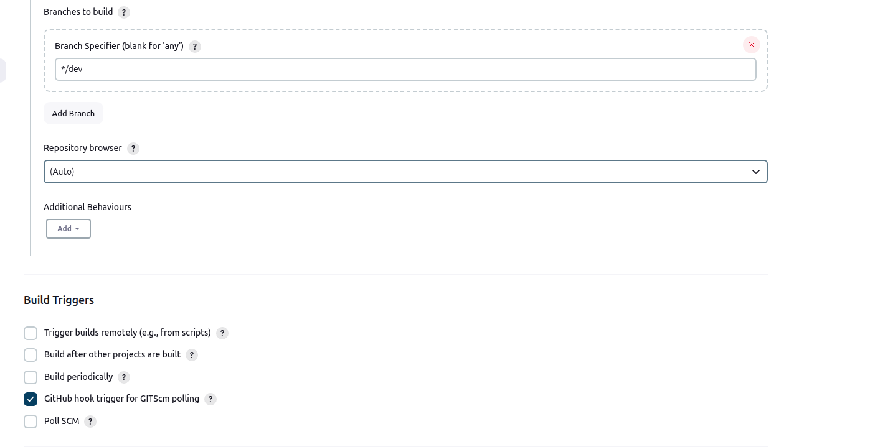

automation is set up on the "control node" (Jenkins node)
we want to create agent nodes, so any changes to code won't affect the server - we want the server to always be running#
the commands will be run on the agent nodes

- start by creating a new item and give it a name
- select freestyle project
- add a description eg. testing Jenkins
- check discard old builds - can control the maximum number of builds you want
- untick restrict where this project can be run
- can add a bash script under build steps section, click execute shell
- click build now when ready to run
- can set new jobs to run automatically run after (or even before)

- ssh needs to be set up between github and jenkins (unable to enter passwords)
- must create a web hook - alerts Jenkins of any changes

**Create a new key-pair:**

- cd into .ssh folder
- run the command: `ssh-keygen -t rsa -b 4096 -C "youremailaddress"`
- name your public key
- leave pass phrase blank - Jenkins cannot enter the pass phrase
- will create both public and private key (private key won't have an extension) - remember private key is sensitive!

- within github repo, under settings click deploy key
- Add a new key and cat public key - the public key will have .pub extension
- copy and paste the public key within the key section, and press allow write access (will allow for automated merges)

- add the private key to Jenkins or can be done separately or when the job is built

**Create the webhook:**

- under settings, select webhook
- add webhook to the same repo containing the code, add the payload url `http://server-ip-address:8080/github-webhook/`
- disable ssl verification for now
- select only the push event to trigger the webhook

# Job 1 - source code management (scm), build and test

- create a new item and give it a name eg. `steph-job1-ci-test`
- select freestyle project
- give the new item a description

- tick discard old builds, set max number to 3
- tick github project, and paste the https url of the github repo (add forward slash to the end of the url) 
- untick restrict where the project can be run
- on the github repo, click code and select SSH 
- under source code management, copy and paste the SSH url
- will give a wall of red text first as no credentials 
- select add credentials, and then select Jenkins - will allow us to add private key

- leave global credentials (unrestricted) as is
- select SSH username with private key
- leave scope as is
- set ID eg. `tech519-steph-github-key-pair`
- can copy and paste into description and username
- leave keep username a secret unticked
- within bash terminal, cat the private key and paste it into Jenkins (will begin and end with dashes) **VERY SENSITIVE**
- select your key pair within credentials drop down (wall of red text will be removed)

- under branches to build section, change branch specifier to \*/main (was master) 
- under build environment, select provide node & npm bin/ folder to PATH
- change nodeJS version to 20
- leave the remaining settings as default 

- select execute shell under build steps drop down menu

```
ls
cd nodejs20-se-test-app-2025
ls
cd app
ls
npm install
npm test
```

- save the item
- run the build - created manually to test the ssh key has been correctly added
- the dashboard will show if the build is successful with a tick and a sun symbol 

- if the build has been unsuccessful, click on the build itself and look at the console output to troubleshoot the agent node (aws instance created by Jenkins)

**implementing the webhook:**

- under build triggers, select github hook trigger for gitscm 
- change branch specifier from _/main to _/dev
- save changes
- if you make a change to code, switch to dev branch `git checkout -b dev` first! make sure you push to the dev branch as well!
- merge on github by comparing pull requests

# Job 2 - merge

- any changes must be automatically merged into CI/Cd pipeline

- first test manually before trying to automate:
- switch to dev branch:
  `git checkout -b dev` - this will create the dev branch if you haven't already, otherwise run `git checkout dev` to switch to existing dev branch
- make a small change
- push the changes:

```
git add .
git commit -m "add-relevant-comment-here"
git push -u origin dev
```

- return to the repo on github,

**steps to automate merging branches:**

- when creating new job, select copy from existing item (to inherit settings)
- leave branch specifier as \*/dev - as the instance will build the branch and then merge into main
- change build triggers to build after other projects are built
- enter the project you want eg. steph-new-ci-build

- remove execute shell under build steps section - no commands need to be run
- always use a plugin instead
- select git publisher under post-build actions section
- select push only if build succeeds
- select merge results

- add branches
- branch to push is main
- target remote name is origin

# Job 3 - Deploy to AWS
