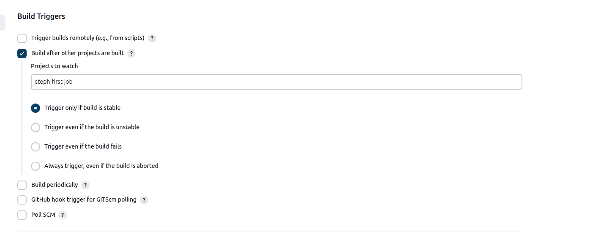

# Chaining two basic jobs together

Jobs can be chained together by triggering one to run one after another has been built

1- repeat steps 1-7 from running_a_basic_job.md
2- under Build Triggers, select the option 'Build after other projects are built`
3- type the name of the build you want to link this new one to under 'projects to watch' ('steph-first-test-job' if following the example from running_a_basic_job.md)
4- set the project to 'trigger only if the build is stable' 
5- leave all settings under Build Environment deselected
6- Select execute shell under the Build Steps drop down menu 
10- Type something simple, like the date (this will show in the console output section of the build)
11- Save the configuration
