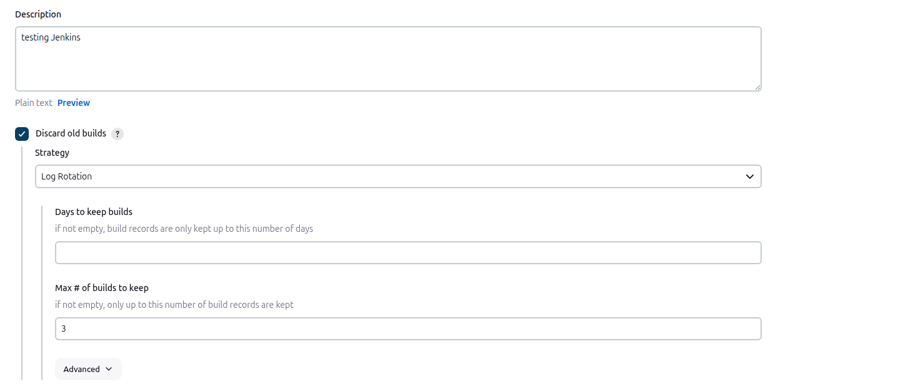
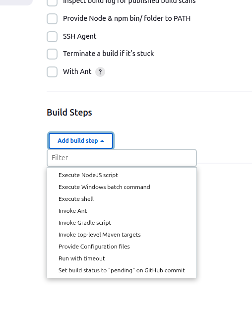
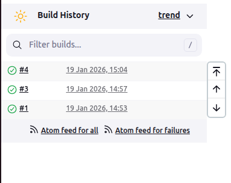
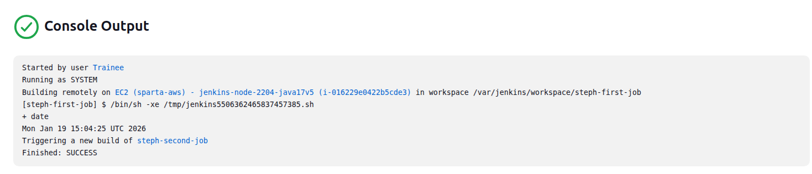

# Creating a basic job using Jenkins

Instructions to create a basic job (no source code management) and familiarising yourself with Jenkins

1- select new item to create a new job
2- name the job eg. 'steph-first-test-job'
3- select freestyle project and click ok to confirm

Now configure settings:
4- add a description to the job eg. 'first jenkins job'
5- select discard old builds and set max number of builds to 3 
6- Deselect restrict where this project can be run, this can be found under Office 365 Connector
7- Select the option 'none' under the Source Code Management section
8- Ensure all settings under Build Triggers and Build Environment are deselected
9- Select execute shell under the Build Steps drop down menu 
10- Type something simple, like the date (this will show in the console output section of the build)
11- Save the configuration
12- Select run build 
13- The console output of the build can be viewed, with the execute shell script running 
